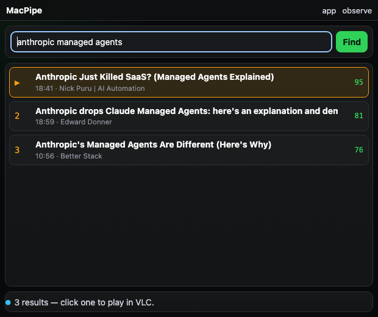
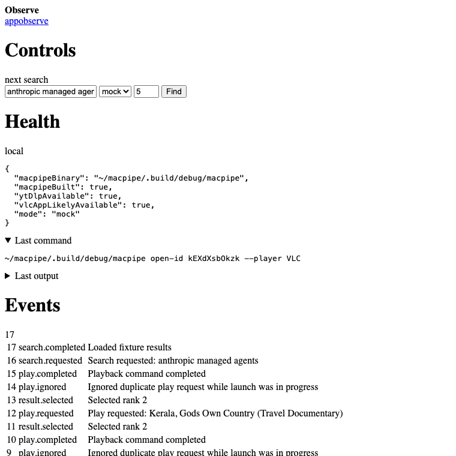

# MacPipe

MacPipe is a tiny macOS utility for searching YouTube and sending selected videos to VLC.

The current best interface is **MacPipe**, a dockable native macOS wrapper around a local, server-rendered workbench. It intentionally avoids a JavaScript-heavy frontend: the UI is plain HTML/CSS, backend-owned state, POST actions, and observable JSON endpoints.

## Screenshots

### App



### Observe / debug surface



## What it does

- Search YouTube through the local `macpipe` CLI.
- Rank/filter results for useful watchability.
- Click a result to open it in VLC.
- Protect against rapid duplicate clicks opening several VLC launches at once.
- Provide an `/observe` page and JSON endpoints for debugging and agent visibility.

## Requirements

- macOS 14+
- Xcode command line tools / Swift 5.9+
- [`yt-dlp`](https://github.com/yt-dlp/yt-dlp)
- [VLC](https://www.videolan.org/vlc/) installed at `/Applications/VLC.app`

Install the external tools with Homebrew:

```bash
brew install yt-dlp
brew install --cask vlc
```

## Clone

```bash
gh repo clone gin6308-collab/macpipe
cd macpipe
```

Or with plain Git:

```bash
git clone https://github.com/gin6308-collab/macpipe.git
cd macpipe
```

## Build the CLI

```bash
swift build --product macpipe -j 1
```

Smoke test search:

```bash
.build/debug/macpipe search "anthropic managed agents" --limit 5 --quality normal --mode education --quality-debug
```

Open a known video ID in VLC:

```bash
.build/debug/macpipe open-id 5z1EX77_3po --player VLC
```

## Build the native workbench app

```bash
chmod +x scripts/build_macpipe_workbench_app.sh
scripts/build_macpipe_workbench_app.sh
```

This creates:

```text
dist/MacPipe Workbench.app
```

Launch it:

```bash
open 'dist/MacPipe Workbench.app'
```

The app starts the local Python workbench server automatically on:

```text
http://127.0.0.1:8787
```

The app bundle is generated and is intentionally ignored by Git. Rebuild it locally whenever needed.

## Workbench usage

1. Open the app.
2. Type a subject into the search box.
3. Press Enter or click **Find**.
4. Click a result to play it in VLC.
5. Use **observe** for mode controls, command output, events, health, and state JSON.

Default mode is real VLC playback.

## Observe and debug endpoints

Human-readable:

```text
http://127.0.0.1:8787/observe
```

JSON endpoints:

```text
http://127.0.0.1:8787/debug/state
http://127.0.0.1:8787/debug/events
http://127.0.0.1:8787/debug/health
```

Debug action endpoints are also available under `/debug/actions/*` for tool-driven testing.

## Using Claude Code

Claude Code is optional, but this repo includes two Claude workflows for review and redesign loops.

Use Claude as a shell tool:

```bash
scripts/claude_review_macpipe.sh
scripts/claude_review_macpipe.sh "Review the duplicate-click VLC guard."
```

Use Claude as an interactive slash command:

```bash
claude
/macpipe-redesign
/macpipe-redesign tighten the observe page and setup docs
```

Details:

```text
docs/claude.md
.claude/commands/macpipe-redesign.md
```

## Design notes

- No React, Vite, npm, or client-side app state.
- Server-rendered HTML forms and redirects.
- VLC remains the real video renderer.
- The workbench is a compact control surface and observable state projection.
- The app window defaults to about 20% of the visible screen area.

See also:

```text
DESIGN.md
```

## Development checks

```bash
python3 -m py_compile workbench/server.py
swift build --product macpipe -j 1
swift test
scripts/build_macpipe_workbench_app.sh
```
